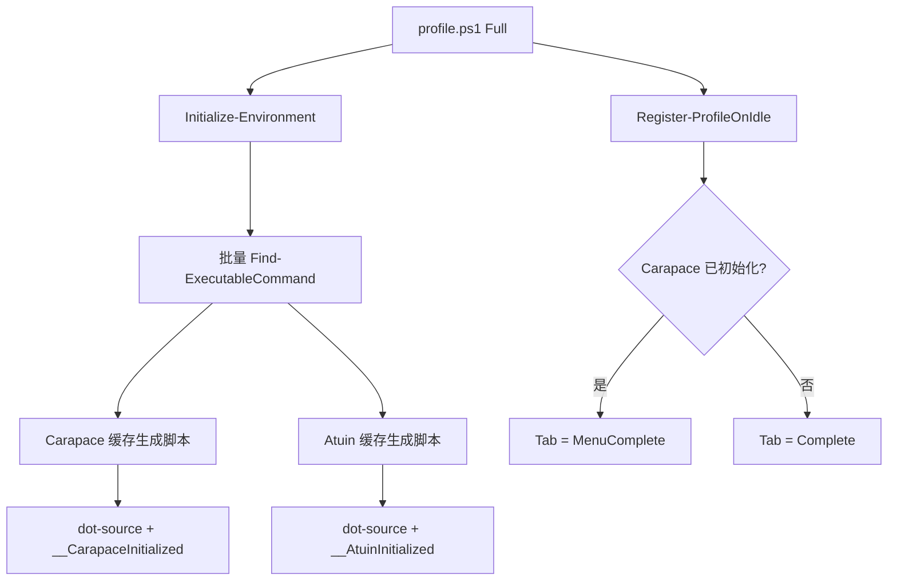

# 技术设计

## 1. 边界

本任务分为两个连续交付：

1. 创建项目本地 `repo-ops` Skill，作为本仓库工程操作约定的稳定入口；Shell Profile 工具集成作为一个独立 reference。
2. 按该 Skill 接入 Carapace 与 Atuin。

安装复用统一应用清单和现有平台 `05`/`08` 入口；不新增工具专属安装脚本。Atuin 账号/同步配置和用户完整 rc 文件不在范围内。

## 2. 项目本地 Skill

### 2.1 路径与触发

新增最终结构：

```text
.agents/skills/repo-ops/
├── SKILL.md
└── references/
    └── shell-profile-integration.md
```

实施时将当前未完成草稿 `.agents/skills/powershellscripts-shell-profile/` 干净迁移到上述结构，不保留 alias、转发 Skill 或重复 reference。

选择 `.agents/skills/`：仓库已有项目本地 Skill 先例；该共享层可被当前 Agent 环境及 Codex/Gemini/Pi 使用，同时不受 `trellis update` bundled-skill 刷新控制。

`repo-ops` 的入口职责是根据仓库操作类型加载对应 reference。当前只提供已经验证需求的 Shell Profile 分支，不为未来可能出现的部署、归档或发布流程创建空文档。

当前触发范围：用户要求在本仓库为 PowerShell、Bash、Zsh profile 增加、修改或审查 CLI 初始化、补全、历史、提示符、键位、延迟加载或相关安装清单。

### 2.2 内容职责

`SKILL.md` 保持短入口：

1. 先确定操作属于哪个已有 reference；没有匹配流程时按仓库 Trellis spec 执行，不臆造新 reference。
2. Shell Profile 请求必须读取 `references/shell-profile-integration.md`。
3. 所有路径、包名和行为以当前仓库代码、清单、spec 与测试为事实来源。
4. 非平凡改动必须执行对应 smoke、专项测试和仓库门禁。

`references/shell-profile-integration.md` 保存当前完整流程：

1. 读取 profile、shell-shared、安装目录与对应测试规范。
2. 全局检查重复初始化、键位冲突与既有包管理器条目。
3. 判定共享片段、Shell 专属片段或 PowerShell Full/OnIdle 的归属。
4. 先做缺失工具降级与重复加载设计，再写实现。
5. 安装只写统一清单；平台 bucket 等前置由通用安装模块处理，不复制专属叶子脚本。
6. 执行三 Shell、安装选择矩阵和仓库门禁。

## 3. Bash/Zsh 数据流


### 3.1 Carapace

新增 `shell/shared.d/10-carapace.sh`：

- 非交互式 Shell 直接返回。
- `command -v carapace` 失败时安静返回。
- 使用会话变量防止重复 source。
- 根据 `$BASH_VERSION` / `$ZSH_VERSION` 执行官方 `_carapace` 初始化。
- 不在本任务默认设置可选 `CARAPACE_BRIDGES`；保持最小原生行为，避免引入额外 bridge 语义和依赖。

数字前缀保证 Zsh 中位于 `00-compinit` 之后，并让 `20-shc-completion` 等命令专属补全最后覆盖对应命令。

### 3.2 Atuin

新增 `shell/shared.d/90-atuin.sh`：

- 非交互式 Shell 或缺少 `atuin` 时安静返回。
- 使用会话变量防止重复 hooks。
- Bash 执行 `atuin init bash --disable-up-arrow`。
- Zsh 执行 `atuin init zsh --disable-up-arrow`。
- 保留现有 `Alt+h` fzf 历史入口；Atuin 使用 `Ctrl+r`，Up 键保持原生行为。

## 4. PowerShell 数据流



### 4.1 初始化归属

两项工具进入 `profile/features/environment.ps1` 的 Full 工具表：

- 加入批量命令探测，Windows/macOS/Linux 全部跟踪。
- 受现有 `SkipTools` 控制，不增加工具专属 Skip 参数。
- 生成脚本分别通过 `Invoke-WithFileCache` 写入 `profile/.cache/`，按平台隔离并 dot-source。
- 使用全局会话状态避免同一进程重复 profile 时再次注册。
- 失败沿用工具级 `try/catch`，不影响其他工具或 profile。

Profile 缺失工具提示仍不加入 `Get-ProfileInstallHintDefinitions`，避免每次启动打印安装建议；系统安装由 `apps-config.json` 与平台 `05`/`08` 入口负责，命令缺失时 Profile 仅 Verbose 跳过。

### 4.2 键位顺序

Carapace 官方要求 `MenuComplete`。现有 OnIdle 最后设置 Tab=`Complete`，因此改为条件设置：

- `$Global:__CarapaceInitialized` 为真：`MenuComplete`。
- 否则：维持 `Complete`。

Atuin 使用 `--disable-up-arrow`，只接管 `Ctrl+r`；现有 PowerShell `Alt+h` 绑定不变。

## 5. 安装数据流

### 5.1 平台选择矩阵

| 平台 | 包管理器与包名 | 预设 | 既有入口 |
| --- | --- | --- | --- |
| Windows | Scoop Main `atuin`、Scoop Extras `carapace-bin` | `core + cli` | `windows/05installCoreCli.ps1` |
| macOS | Homebrew `atuin`、`carapace` | `core + cli` | `macos/05installCoreCli.ps1` |
| Linux | Homebrew `atuin`、`carapace` | `cli + terminal-extras` | `linux/08installFullApps.ps1` |

Linux Core 不选择两项工具，但三套 profile 仍保留命令守护，手工安装后即可启用。

### 5.2 清单建模

- Windows Scoop 条目分别标记 `supportOs: ["Windows"]`；Carapace 条目增加 `bucket: "extras"`，Atuin 使用默认 Main bucket。
- macOS 与 Linux 对相同 Homebrew formula 使用两个 OS 专属条目：macOS 条目标记 `core + cli`，Linux 条目标记 `cli + terminal-extras`。`TargetOS` 筛选后每个平台只会选中自己的条目。
- `Test-PackageManagerAppCatalog` 与平台选择测试负责防止同一目标 OS 出现重复选择或错误标签。

### 5.3 Scoop Extras 前置

扩展既有 Scoop bucket 逻辑，而不是复制字体安装实现：

1. 从 `Install-WindowsScoopFonts` 抽取通用 `Initialize-WindowsScoopBucket`，统一兼容 Scoop 新版对象输出与旧版文本输出。
2. `Invoke-WindowsScoopCatalogInstall` 从已选应用提取非空 `bucket` 集合并逐个调用该 helper。
3. Preview 返回 `scoop bucket add <bucket>` 计划，不修改系统。
4. 实际执行时先查询 `scoop bucket list`；缺失才添加，已存在返回 `AlreadyPresent`。
5. 任一 required bucket 添加失败时停止应用安装并返回 required failure；bucket 就绪后仍由 `Install-PackageManagerApps` 安装清单应用。
6. `Install-WindowsScoopFonts` 改用同一 helper，保持 nerd-fonts 现有行为不变。

这是通用清单能力，不写 Carapace 专属分支；清单校验补充可选 `bucket` 字段约束为非空、符合 Scoop bucket 名格式且仅允许 Scoop 条目使用。

## 6. 测试设计

### 6.1 Bash/Zsh

新增 Vitest，使用临时 PATH 中的假 `carapace` / `atuin`：

- 缺失工具时 source 成功且无输出错误。
- Bash/Zsh 调用正确 shell 参数。
- Atuin 包含 `--disable-up-arrow`。
- 重复 source 时每项初始化只执行一次。
- Zsh 完整部署名顺序满足 `00-compinit` < `10-carapace` < `20-shc-completion`。

### 6.2 PowerShell

扩展 Pester：

- 命令发现集合包含 Carapace 与 Atuin，但缺失时不进入安装提示。
- Full 模式通过 fixture 脚本观察两项初始化；Minimal/UltraMinimal 不启动对应命令。
- Carapace 成功时 OnIdle 后 Tab 为 `MenuComplete`；未安装时仍为 `Complete`。
- Atuin 生成命令包含 `powershell --disable-up-arrow`。
- 重复加载不重复初始化和 OnIdle 订阅。

### 6.3 安装选择

- Windows Core 选择由 10 项更新为 12 项，包含 `atuin`、`carapace-bin`；验证 Extras bucket 的 Preview、已存在、添加成功、失败停止，以及 nerd-fonts 回归。
- macOS Core 选择包含 `atuin`、`carapace`。
- Linux Core 不包含两项工具；Linux `terminal-extras` 同时包含两项工具。
- 三个平台继续通过现有 `05`/`08` 入口消费清单，不维护第二份期望包名。

## 7. 兼容、风险与回滚

- 风险：Carapace 改变 PowerShell Tab 菜单行为。通过“仅 Carapace 成功时切换”限制影响面。
- 风险：Atuin 重复 hooks。通过三 Shell 会话守卫和重复加载测试处理。
- 风险：新增外部进程拖慢 PowerShell Full 冷启动。通过文件缓存与真实入口性能 smoke 观察。
- 风险：Carapace 覆盖命令专属补全。通过文件数字前缀让专属 completion 后加载。
- 风险：Windows 缺少 Extras bucket。通过通用 `Initialize-WindowsScoopBucket`、清单字段校验和必需前置结果处理。
- 风险：Homebrew 同名 formula 分为 macOS/Linux 两条。通过 `supportOs` 隔离及选择矩阵测试防止同平台重复。
- 回滚：删除两个共享片段；移除 PowerShell 工具表项与条件 Tab；移除 6 条平台清单条目及通用 Scoop bucket 支持；恢复安装规范、测试与 README，并重新执行 `shell/deploy.sh` 清理失效链接。
