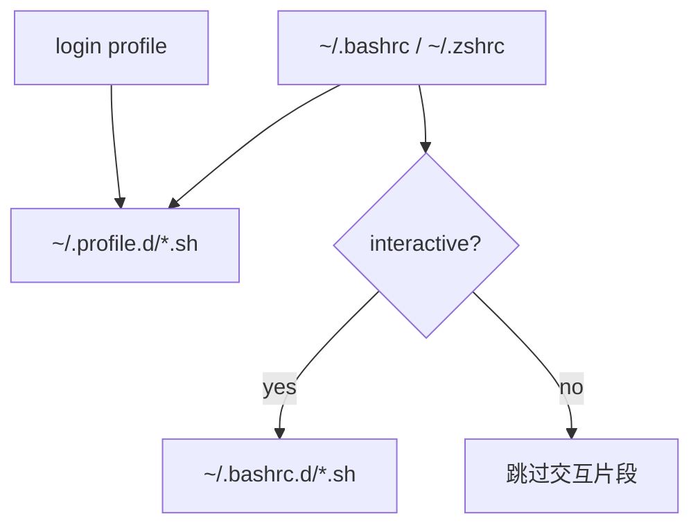

# Shell 启动层级与 Profile 治理设计

## 1. 设计目标

建立一套可执行的 Shell 启动分层，使同一份基础环境既能服务真实 login shell，也能服务常见交互终端，同时避免把 alias、补全、prompt、网络探测等交互副作用带入非交互进程。

本任务先更新 `.trellis/spec/`，再按规范实施。治理范围覆盖 `shell/` 全目录的启动层归属，不重构各命令内部与启动行为无关的业务逻辑。

## 2. 约束与事实

- Bash login shell 按 `~/.bash_profile`、`~/.bash_login`、`~/.profile` 顺序只读取第一个可读文件。
- Bash 交互式非 login shell读取 `~/.bashrc`；sshd 启动的非交互 Bash通常也读取 `~/.bashrc`，但用户文件可能在受管块前提前 `return`，因此本任务不承诺覆盖所有 SSH 远程命令。
- 普通 cron 不自动读取 profile 或 bashrc；本任务不通过隐式 shell 配置覆盖 cron。
- Zsh login 环境入口为 `~/.zprofile`，交互入口为 `~/.zshrc`。
- macOS 仍需兼容系统 Bash 3.2；profile 层同时被 Bash 与 Zsh source，必须使用两者都支持的保守语法。
- `shell/shared.d/env.local.sh` 同时被 PowerShell profile 解析，是本机私有配置桥接入口；本任务不扩大其加载范围，避免让现有 API key 自动进入所有非交互 login shell。
- 用户 rc/profile 的 marker 外内容不可修改；发生真实写入前必须生成可读时间戳 `.bak`。

## 3. 目录与职责

```text
shell/
├── profile.d/     # 基础环境；login 与 interactive 均可安全 source
├── shared.d/      # Bash/Zsh 共享的交互命令、alias、函数和工具初始化
├── bash.d/        # Bash 专属交互行为
├── zsh.d/         # Zsh 专属交互行为
└── deploy.sh      # 同步目录并维护受管 loader
```

部署目标保持现有兼容路径：

```text
shell/profile.d/*.sh  -> ~/.profile.d/*.sh
shell/shared.d/*.sh   -> ~/.bashrc.d/*.sh
shell/bash.d/*.sh     -> ~/.bashrc.d/*.sh
shell/zsh.d/*.zsh     -> ~/.bashrc.d/*.sh  # 部署时沿用现有 .sh 目标名
```

`~/.profile.d` 是本仓 loader 管理的目录，不依赖操作系统自动识别。

### 3.1 `profile.d` 合同

允许：

- `export` 环境变量；
- 幂等 PATH 追加或前置；
- 安静的工具环境生成，例如受控执行 `fnm env`；
- 根据 `$-` 区分交互与非交互参数，但不得注册交互命令。

禁止：

- alias、补全、prompt、键位和长期保留的辅助函数；
- stdout/stderr 输出；
- 网络连通性探测、后台进程或交互程序；
- 依赖 `shared.d`、`bash.d`、`zsh.d` 中的函数；
- Bash 4+ 数组、Zsh 专属语法或其它破坏 Bash 3.2/Zsh 双兼容的写法。

每个文件必须可重复 source：PATH 不重复，工具初始化有会话标记或等价幂等保证，临时变量在结束前清理。

### 3.2 交互层合同

- `shared.d` 只放 Bash/Zsh 都能解析的交互行为。
- `bash.d`、`zsh.d` 只放对应 shell 专属行为。
- 交互判断由受管 rc loader 统一执行；高风险或可被单独 source 的片段仍可保留自身 guard。
- 交互层可以定义函数、alias、补全与 prompt，但 source 时不得产生无条件输出。
- 网络探测等启动副作用只能留在交互层，并继续支持显式关闭。

## 4. 加载流程



具体行为：

1. Bash login：选择实际生效的候选 profile，source `~/.profile.d/*.sh`。
2. Zsh login：`~/.zprofile` source `~/.profile.d/*.sh`。
3. Bash/Zsh 交互 rc：先 source `~/.profile.d/*.sh`，再仅在交互会话 source `~/.bashrc.d/*.sh`。
4. 交互 login shell 可能先经 profile、再由用户配置转入 rc；`profile.d` 必须允许重复 source。
5. rc 受管块不得使用 `return` 或 `exit`，避免截断 marker 后的用户配置。

## 5. 受管文件选择与迁移

### 5.1 Bash login profile 选择

按以下顺序选择第一个已存在的文件：

1. `~/.bash_profile`
2. `~/.bash_login`
3. `~/.profile`

都不存在时创建 `~/.profile`。Zsh固定使用 `~/.zprofile`。

### 5.2 Marker

保留现有 login marker 以完成无缝升级：

```text
# >>> powershell-scripts login env >>>
# <<< powershell-scripts login env <<<
```

内容从内联 Homebrew/fnm 改为 `~/.profile.d/*.sh` loader。

rc loader 升级为成对 marker；现有单行 marker `# Load modular configuration files from ~/.bashrc.d` 视为 legacy block，在首次部署时整体迁移到新受管块。

### 5.3 目标变化

每次 Bash 部署都扫描三个候选 profile：

- 在当前有效目标写入或更新 login block；
- 从其它候选文件删除本仓 login block；
- 只处理精确 marker 内内容；
- 每个发生变化的既有文件分别备份；
- dry-run 只报告写入、替换、迁移、清理及备份目标。

这保证用户后来创建 `~/.bash_profile` 时，受管块会从旧 `~/.profile` 迁移，不形成双重加载。

## 6. `deploy.sh` 结构

将当前只面向 `CONFIG_DIR` 的函数参数化：

- `ensure_dir <dir>`
- `cleanup_stale_symlinks <target-dir>`
- `sync_dir <source-dir> <target-dir> <ext> <rename-zsh>`
- `select_login_profile`
- `render_profile_loader`
- `render_interactive_loader`
- `update_managed_block <file> <start-marker> <end-marker> <content> <create-if-missing>`
- `remove_managed_block <file> <start-marker> <end-marker>`

执行顺序：

1. 解析目标 shell；
2. 准备 `~/.profile.d` 与 `~/.bashrc.d`；
3. 清理两处失效 symlink；
4. 同步 `profile.d` 与交互片段；
5. 维护有效 login profile，并清理失效候选中的本仓 block；
6. 维护 `~/.bashrc` / `~/.zshrc` 交互 loader。

先同步再写 loader，避免 loader 指向尚未准备完成的目录。任一步骤失败时返回非零，不伪装部署成功。

## 7. 现有片段治理结果

### 7.1 迁入或拆入 `profile.d`

| 当前文件 | 处理 |
|---|---|
| `shared.d/homebrew.sh` | 移到 `profile.d/10-homebrew.sh`，作为唯一 Homebrew Shell 环境实现 |
| `shared.d/package-sources.sh` | 移到 `profile.d/05-package-sources.sh`；加载后不遗留辅助函数 |
| `shared.d/node.sh` 环境部分 | 拆到 `profile.d/20-node.sh`：fnm、Bun、pnpm 环境 |

`profile.d/20-node.sh` 根据交互状态选择 fnm 参数：

- 非交互 shell：`fnm env`
- 交互 shell：`fnm env --use-on-cd`

同一片段服务两种入口，避免 profile 与 rc 复制实现。

### 7.2 留在交互层

| 类别 | 文件与依据 |
|---|---|
| 补全/历史/prompt | `10-carapace.sh`、`90-atuin.sh`、`zz-prompt.sh`、`bash.d/*`、`zsh.d/*` |
| alias 与交互 CLI | `aliases.sh`、`modern-tools.sh`、`fzf-*`、`python.sh`、`tmux.sh`、`zellij.sh`、`bluetooth.sh` |
| 宿主工具函数 | `ai.sh`、`browser-debug.sh`、`claude-profile.sh`、`selfhosted.sh`、`vscode.sh` |
| 有意的交互副作用 | `proxy.sh` 的代理探测、`git-delta.sh` 的 TTY pager |
| 需要函数/hook 的工具 | `java.sh` 的 SDKMAN 初始化 |
| 交互本机配置 | `env.local.sh`，保留 PowerShell 共享路径且不扩大 secret 暴露范围 |
| 交互 PATH 辅助 | `path.sh`，依赖 `env.local.sh` 中可能覆盖的 `CARGO_HOME`，本次不提升到 login 层 |

### 7.3 `node.sh` 拆分

- `shared.d/node.sh` 改名为 `shared.d/package-scripts.sh`，只保留脚本选择函数与 `pscripts` alias。
- Bun Zsh completion 移入新的 Zsh 专属片段，避免 shared 文件内嵌 shell 分支。
- 旧 `~/.bashrc.d/node.sh`、`homebrew.sh`、`package-sources.sh` 软链接在源文件移动后由 stale cleanup 删除。

## 8. 兼容与安全

- 不修改 `env.local.sh` 实际内容，也不在日志或测试中输出 secret。
- 不改变 `--exclude` CLI；模式同时作用于 profile 与交互源文件 basename。
- `profile.d` 不使用 `eval` 处理外部任意输入；仅允许受控工具生成的初始化脚本，失败时安静降级且不设置成功标记。
- `fnm env` 生成或 eval 失败时不能阻断后续 profile 片段。
- marker 损坏策略沿用当前修复语义：只有 start marker 时替换到文件尾；孤立 end marker视为用户内容保留。
- 不增加旧路径 shim；部署清理旧 symlink，代码与文档统一切换到新路径。

## 9. 测试设计

行为测试必须覆盖：

- Bash 三个 login profile 候选的优先级；
- 候选目标变化后的 block 迁移与双路径清理；
- 新旧 rc loader 迁移；
- profile/interactive 目录同步、模板排除和 stale symlink 清理；
- profile 片段重复 source 后 PATH 不重复；
- 非交互 login 不出现 alias、补全、prompt、代理探测；
- 交互 Bash/Zsh 获得 `--use-on-cd`，非交互 login 不获得；
- Homebrew 在 fnm 前恢复，Node/npm/pnpm 可发现；
- dry-run 不创建目录、文件、备份或 symlink；
- macOS Bash 3.2 可解析 loader 与 profile 片段；
- PowerShell 的 `env.local.sh` 解析合同保持不变。

## 10. 回滚

- profile/rc 文件可从本次时间戳 `.bak` 恢复。
- 删除新 `~/.profile.d` symlink 后，恢复旧 commit 的 `deploy.sh` 并重新部署即可回到内联 block。
- 迁移提交必须保持单次 clean cutover；不保留并行 loader、旧文件副本或兼容转发脚本。
