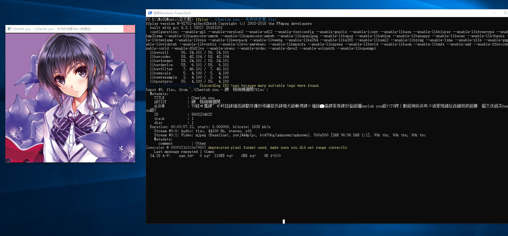

[TOC]


## 前言

最近电脑硬盘空间有点不够，所以就想着把近期的一批wav格式音声资源压缩一下。

关于音频压缩格式，看了网上的一些文章。

谈谈我目前比较粗浅的认识。

无损音频格式，主要有两种，ape，和flac，这两种对比，我选择flac。

flac是开源的，并且压缩率和ape差不太多（50%左右）。解码效率和压缩效率（速度）都高于ape。

ape的压缩率可能略高一些，但是优势很不明显。


有损音乐格式，主要是两种，mp3和aac，mp3很长一段时间都是“免费”的。而aac仍然受到专利保护，虽然推出的年份差不太多（aac是1997年在mp3之后推出）。

总之各种原因，现在市场上，mp3相当于基础设施一样的东西，得到普遍的支持，aac仍然需要版权（mp3的专利已经过期。），所以aac系统支持度、普及度要低很多。

aac的压缩率比mp3更高，而且在低码率下比mp3有更好的音质。同时功能更强大，支持的码率也比mp3高得多


mp3的压缩原理大意是 把人耳不敏感的那部分频率主要是高频，删除掉。比较简单粗暴，所以，我们能从频谱上分辨出来mp3。

无论是mp3还是aac，据说到码率达到192k以上，一般人就很难分得出压缩后的音乐和压缩之前的的区别了。

还有一种说法是，256k的aac，音质比320k的mp3要好。

aac不像mp3一样直接把高频切掉，就我了解到的来看，有一点是动态码率，会把声音比较稀疏的地方，码率也会低一些。

aac是苹果公司大力推行的格式，比如说，itunes里面的音乐就是256k的aac，除此之外，还广泛应用在mp4容器的音轨。除此之外，我下载到全民kg歌的文件，是m4a的后缀，但是实际上，里面的音源还是aac格式。


既然aac是压缩率更高，编码效率更高。个人使用起来也是有一些播放器可以解码的，比如说potplayer，所以日常使用没有什么障碍。所以说我决定用aac格式来压缩硬盘内的wav。

接下来就涉及到压缩时的比特率选择问题。

因为苹果公司的itunes音乐采用256k码率的aac，应该是在音质和大小上做了取舍的结果，所以我就使用这个码率来压缩。

实际压缩后的大小aac 320k和mp3 320k比较接近，压缩速率aac更快一些。

压缩后大小大约在源文件的25%，如果是128k的mp3的话，大小会再缩小一倍。


## ffmpeg命令行的简单使用

首先把ffmpeg.exe的目录加入到环境变量的path参数中，就可以在命令行识别了

在powershell中输入 ffmpeg命令，会出现一些提示

```powershell
ffmpeg version N-92752-g16ec62bbf4 Copyright (c) 2000-2018 the FFmpeg developers
  built with gcc 8.2.1 (GCC) 20181201
  configuration: --enable-gpl --enable-version3 --enable-sdl2 --enable-fontconfig --enable-gnutls --enable-iconv --enable-libass --enable-libbluray --enable-libfreetype --enable-libmp3lame --enable-libopencore-amrnb --enable-libopencore-amrwb --enable-libopenjpeg --enable-libopus --enable-libshine --enable-libsnappy --enable-libsoxr --enable-libtheora --enable-libtwolame --enable-libvpx --enable-libwavpack --enable-libwebp --enable-libx264 --enable-libx265 --enable-libxml2 --enable-libzimg --enable-lzma --enable-zlib --enable-gmp --enable-libvidstab --enable-libvorbis --enable-libvo-amrwbenc --enable-libmysofa --enable-libspeex --enable-libxvid --enable-libaom --enable-libmfx --enable-amf --enable-ffnvcodec --enable-cuvid --enable-d3d11va --enable-nvenc --enable-nvdec --enable-dxva2 --enable-avisynth --enable-libopenmpt
  libavutil      56. 24.101 / 56. 24.101
  libavcodec     58. 42.104 / 58. 42.104
  libavformat    58. 24.101 / 58. 24.101
  libavdevice    58.  6.101 / 58.  6.101
  libavfilter     7. 46.101 /  7. 46.101
  libswscale      5.  4.100 /  5.  4.100
  libswresample   3.  4.100 /  3.  4.100
  libpostproc    55.  4.100 / 55.  4.100
Hyper fast Audio and Video encoder
usage: ffmpeg [options] [[infile options] -i infile]... {[outfile options] outfile}...

Use -h to get full help or, even better, run 'man ffmpeg'
```


我们知道简单用法

`ffmpeg [options][[infile options] -i infile]... {[outfile options] outfile}...`

ffmpeg 默认mp3的码率是128k，aac格式默认的码率也偏低。所以我们要指定更高的码率

`ffmpeg -i  inputname.wav -b:a 256k  outputname.aac`

-b 指的是设定比特率，后面跟着`:a`,说明要编码的是一个音频文件 audio


其余的工具还有ffplay.exe,用于播放音频，视频，`ffplay test.avi  `

测试播放一首flac格式的日文歌，效果如下，应该是要通过输入一些命令来实现播放器的一些快进之类的功能



ffprobe.exe,用于查看文件格式